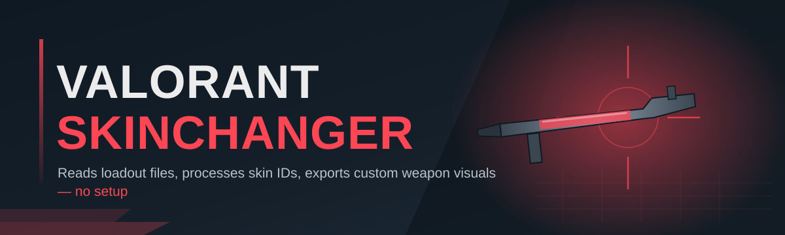
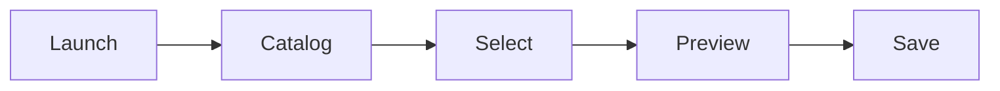

# valorant-skin-editor 🎨🔫

  

*Swap, preview, and lock in any Valorant weapon skin locally — no grind, no waiting on the shop rotation.*

  

## 🧭 Overview

`valorant-skin-editor` is a lightweight, standalone Windows tool built for one purpose: giving you full visual control over your Valorant loadout without touching your account's actual inventory or progression. Think of it as a local render layer that sits between "what you own" and "what you see" — a personal skin locker that never expires, never rotates out of the shop, and never asks you to grind Radianite.

This project exists because the default Valorant skin economy is built around scarcity and FOMO — limited bundles, timed shop cycles, and a store algorithm that seems to know exactly which skin you *don't* want to see twice. A solo dev (hi) got tired of that friction and built a tool that puts the visual customization decision back in the player's hands. No spreadsheets of Valorant Points, no waiting for a Night Market that never rolls the right knife.

It's built for the Valorant Skinchanger crowd who care about aesthetics as much as aim — collectors who want to preview finisher animations before committing VP, tinkerers who like fast iteration on their loadout look, and anyone who thinks the in-game skin browser is clunky compared to a proper editor UI. If you've ever alt-tabbed mid-match just to double check what chroma you had equipped, this tool is for you.

---

## 🌟 The Headliner

> [!TIP]
> This is the feature everyone asks about first — so it goes first.

**Live weapon skin preview with zero restart.** Change a skin, chroma, or finisher and see it reflected instantly in a real-time 3D viewport — no relaunching the client, no reloading a match, no waiting on asset streaming. It's the difference between flipping through a photo album and watching the picture change in your hands.

| Capability | What it actually does |
|---|---|
| ⚡ **Instant Preview** | Renders the selected skin, chroma, and level in a live 3D viewport as you click — no client restart |
| 🎯 **Full Arsenal Coverage** | Every weapon category is supported — Vandal, Phantom, knives, Sheriff, Operator, and the rest of the roster |
| 🌈 **Chroma & Level Switching** | Cycle through every unlocked variant and upgrade level for a skin in one dropdown, not four menus |
| 🎬 **Finisher Playback** | Trigger and preview kill-banner finisher animations on demand, outside of an actual match |
| 💾 **Loadout Profiles** | Save named presets — "Ranked Loadout," "Clean Aesthetic," "Chaos Mode" — and swap between them in one click |
| 🔎 **Searchable Skin Browser** | Filter by weapon, bundle, rarity, or name instead of scrolling a giant grid |
| 🧩 **Config Export/Import** | Share your loadout config as a portable file so friends can load your exact setup |
| 🖥️ **Overlay-Friendly UI** | A borderless, always-on-top panel designed to sit alongside the game window without stealing focus |

> [!NOTE]
> All previews and edits are rendered locally through the editor's own viewport. This is a visual customization utility, not a modification of match-server data.

---

## 🚀 Getting Rolling

Setup is intentionally boring — that's the point. No dependency chasing, no runtime installs.

1. Hit the **GET STARTED** button above to reach the landing page.

2. Download the latest standalone build for Windows.

3. Run the executable — no installer wizard, no background service.

4. Pick your weapon, browse skins, and hit preview. That's it.

> [!IMPORTANT]
> Always download from the official landing page linked in this README. Third-party mirrors are not maintained by this project and may ship outdated or altered builds.

---

## 🖥️ System Requirements

| Requirement | Detail |
|---|---|
| OS | Windows 10 or Windows 11 (64-bit) |
| Install type | Standalone `.exe` — nothing to install |
| Dependencies | None — everything needed ships in the build |
| Disk space | Under 300 MB |
| GPU | Any DirectX 11-capable card handles the preview viewport fine |

  

---

## ⚙️ How It Works

The editor follows a straightforward local pipeline — read your asset catalog, let you pick, render the result, save the config.

1. **Launch** — the app boots and initializes its local rendering layer.

2. **Catalog** — it indexes the full weapon and skin catalog bundled with the tool.

3. **Select** — you browse and pick a weapon, skin, chroma, and level.

4. **Preview** — the 3D viewport renders your choice in real time.

5. **Save** — your loadout gets written to a local profile you can reload anytime.

---

## 🧰 Troubleshooting

<strong>The preview window opens black or stays frozen.</strong>

Update your GPU drivers first — the viewport relies on DirectX 11, and stale drivers are the #1 cause of a blank render.

<strong>My saved loadout profile didn't load on relaunch.</strong>

Make sure the app has write permission to its own folder. Running from a heavily restricted directory (like `Program Files` without admin rights) can silently block profile saves.

<strong>Some skins are missing from the browser.</strong>

The catalog updates alongside game patches. If a brand-new bundle just dropped, give the project a day or two to ship a catalog refresh.

<strong>Windows Defender flagged the download.</strong>

Unsigned indie executables often trip heuristic flags. Verify you downloaded from the official landing page linked in this README before proceeding.

<strong>Finisher animations look choppy.</strong>

Lower the preview resolution in Settings → Display. The finisher playback is animation-heavy and benefits from a smaller viewport on lower-end GPUs.

> [!WARNING]
> This tool renders visuals locally and does not modify match-server records. Any use outside of intended personal customization is outside the scope and support of this project.

---

## 🎛️ UI & UX Details

The interface is built to feel like a proper editor, not a modded menu bolted onto the game.

- **Themes** — Dark (default), Light, and a high-contrast "Ranked Night" mode

- **Keyboard shortcuts:**

  | Key | Action |
  |---|---|
  | `Ctrl + S` | Save current loadout profile |
  | `Ctrl + O` | Open a saved profile |
  | `Space` | Trigger finisher preview |
  | `Tab` | Cycle weapon category |
  | `Esc` | Close preview overlay |

- **Settings panel** — adjustable render quality, overlay opacity, always-on-top toggle, and startup profile selection

- **Search-as-you-type** — the skin browser filters live, no submit button required

---

## 🤝 Contributing & Community

This started as a solo project and grew because people kept showing up with good ideas.

> Pull requests, issue reports, and skin catalog corrections are all welcome. If you're adding a new feature, open an issue first so we can talk scope before you write code.

- Found a bug? Open an issue with your Windows version and a screenshot.

- Have a feature idea? Discussions are open — no idea is too small to float.

- Want to help with catalog upkeep after patches? That's often the highest-impact contribution.

---

## 📜 License

Released under the [MIT License](LICENSE), 2026.

---

## ⚠️ Disclaimer

`valorant-skin-editor` is an independent, fan-made customization utility and is not affiliated with, endorsed by, or associated with Riot Games. Valorant is a trademark of Riot Games, Inc. This tool renders visual customizations locally and does not alter match outcomes, competitive standing, or server-side data. Use responsibly and in accordance with the game's terms of service.

